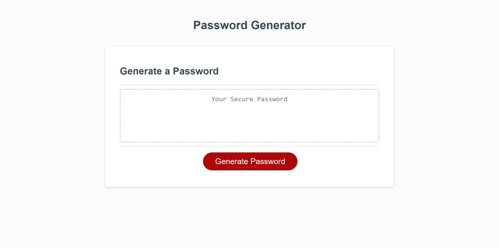

# My_Password_Generator
#Description
-Random Password Generator

I was given starter code of an unfinished password genertor that needed to be debugged. I needed to fix the links for css and javascript first on the html page. The purpose of this challenge was to understand JavaScript elements on how it can add an extra layer to your application. For loops, variables, alerts, console.log, if statements, event listeners, local storage and queryselectors were some js properities used to create an event that stores the data the user chooses and enters with prompts/alerts displaying if data is missing.

#Mock_UP

#Usage

JavaScript is one of the most important applications that developers need in there career. JavaScript allows your application to go from basic html and css to being able to have events and different effects that look appealing to the eye and targets the users criteria. As future developers, there will be more complex broad code that learning these different properties allows us to psuedo/breakdown code.  

#Credits

Deploy Path-![alt My_Password_Generator]./assets/images/My_Password_Generator.jpeg/

GitHub_Deploy-"https://ameridacas.github.io/My_Password_Generator/"

Github_Repo-"https://github.com/ameridacas/My_Password_Generator"